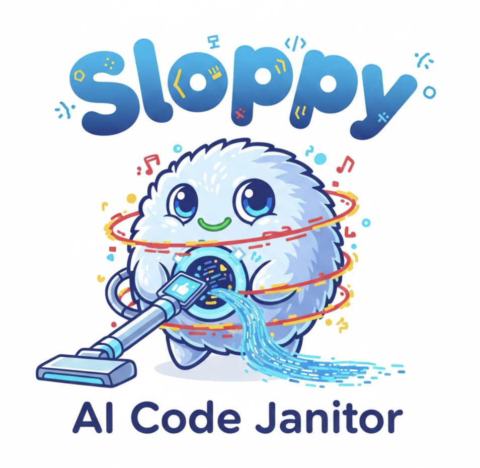

<p align="center">
  
</p>

<p align="center">
  <strong>Your AI writes code. Sloppy makes it production-ready.</strong>
</p>

<p align="center">
  <a href="#quickstart">Quickstart</a> •
  <a href="#features">Features</a> •
  <a href="#how-it-works">How It Works</a> •
  <a href="#configuration">Configuration</a> •
  <a href="https://sloppy.dev/docs">Docs</a>
</p>

<p align="center">
  
  
  = 22" />
</p>

---

## The Problem

You vibe-coded a feature in 10 minutes. Feels great. Ship it?

**Not so fast.** That AI-generated code has:

```
❌ TODO: implement error handling
❌ 47 TypeScript errors
❌ Security vulnerabilities (SQL injection on line 234)
❌ Copy-pasted code everywhere
❌ Zero test coverage
❌ Dead code that does nothing
```

You could spend 3 hours fixing it. Or...

## The Solution

```bash
npx sloppy
```

**Sloppy turns AI slop into production code.** It finds the mess. It fixes the mess. It commits the fixes. You review and merge.

```
┌─────────────────────────────────────────────────────────────┐
│                                                             │
│   🔍 Analyzing...                                          │
│   ├── Found 12 stub implementations                        │
│   ├── Found 8 security vulnerabilities                     │
│   ├── Found 47 type errors                                 │
│   └── Found 23 lint violations                             │
│                                                             │
│   🔧 Fixing...                                             │
│   ├── ✅ Implemented auth middleware (commit: a3f2b1c)     │
│   ├── ✅ Fixed SQL injection in user.ts (commit: b4c3d2e)  │
│   ├── ✅ Resolved type errors (commit: c5d4e3f)            │
│   └── ✅ Applied ESLint fixes (commit: d6e5f4g)            │
│                                                             │
│   📊 Results: 90 issues fixed, 0 tests broken              │
│                                                             │
└─────────────────────────────────────────────────────────────┘
```

Each fix = one atomic git commit. Don't like a fix? `git revert`. Simple.

---

## Quickstart

```bash
# Install
pnpm install

# Configure your AI provider
export ANTHROPIC_API_KEY=sk-...  # or OPENAI_API_KEY

# Build
pnpm build

# Run
pnpm start
```

Open `http://localhost:3000` and point it at your repo.

---

## Features

### 🔍 8 Parallel Analyzers

| Analyzer | What It Catches |
|----------|-----------------|
| **Stubs** | `TODO`, `FIXME`, empty implementations, placeholder code |
| **Duplicates** | Copy-pasted code blocks, redundant logic |
| **Bugs** | Null refs, unreachable code, unused variables |
| **Types** | TypeScript errors, missing types, `any` abuse |
| **Lint** | ESLint violations, formatting issues |
| **Security** | SQL injection, XSS, hardcoded secrets, OWASP Top 10 |
| **Coverage** | Untested code paths, missing test files |
| **Dead Code** | Unused exports, unreachable functions |

All analyzers run **in parallel**. Full codebase scan in seconds, not minutes.

### 🤖 Multi-Provider AI

```
┌─────────────┐    ┌─────────────┐    ┌─────────────┐
│   Claude    │    │   OpenAI    │    │   Ollama    │
│  (Default)  │    │   GPT-4o    │    │   Local     │
└─────────────┘    └─────────────┘    └─────────────┘
        │                 │                  │
        └────────────────┬──────────────────┘
                         │
                         ▼
              ┌─────────────────┐
              │  Unified API    │
              │  Rate Limited   │
              │  Auto-Retry     │
              └─────────────────┘
```

Use Claude for quality. Use GPT-4o for speed. Use Ollama for privacy. Switch anytime.

### 🎯 Surgical Fixes

Sloppy doesn't rewrite your codebase. It makes **minimal, targeted changes**:

- Each issue = one focused fix
- Each fix = one git commit
- Each commit = independently revertible

Your git history stays clean. Your code reviews stay sane.

### 🛡️ Safety First

```bash
# Checkpoint before risky changes
sloppy checkpoint create "before-auth-refactor"

# Something broke?
sloppy checkpoint restore "before-auth-refactor"
```

- Automatic checkpoints before destructive operations
- Test verification after every fix
- Instant rollback to any checkpoint

### ⚡ Real-Time UI

<p align="center">
  
</p>

Watch fixes happen live. Approve or reject changes. Track metrics over time.

---

## How It Works

```
┌──────────────┐     ┌──────────────┐     ┌──────────────┐
│   Analyze    │────▶│     Fix      │────▶│   Verify     │
│  (Parallel)  │     │   (AI Gen)   │     │   (Tests)    │
└──────────────┘     └──────────────┘     └──────────────┘
       │                    │                    │
       ▼                    ▼                    ▼
  Find issues         Generate fix        Run test suite
  Deduplicate         Apply patch         Check for breaks
  Prioritize          Commit change       Revert if failed
```

**The Loop:**

1. **Scan** - Run all 8 analyzers in parallel
2. **Prioritize** - Sort by severity (security > bugs > types > lint)
3. **Fix** - AI generates minimal fix for highest priority issue
4. **Verify** - Run tests to ensure nothing broke
5. **Commit** - Atomic commit with descriptive message
6. **Repeat** - Until all issues resolved or time limit hit

---

## Configuration

### Basic: `sloppy.config.json`

```json
{
  "maxTime": "2h",
  "provider": {
    "type": "claude",
    "model": "claude-sonnet-4-20250514"
  },
  "strictness": "high",
  "issues": {
    "stubs": true,
    "duplicates": true,
    "bugs": true,
    "typeErrors": true,
    "lintErrors": true,
    "security": true,
    "missingTests": true,
    "deadCode": true
  }
}
```

### Strictness Levels

| Level | Catches | Best For |
|-------|---------|----------|
| `low` | Critical bugs, security issues | Quick cleanup |
| `medium` | + Type errors, lint violations | Regular maintenance |
| `high` | + Style issues, minor code smells | Production prep |

### Approval Mode

Don't trust AI to commit directly? Enable approval mode:

```json
{
  "approvalRequired": true
}
```

Every fix pauses for your approval before committing.

---

## Architecture

```
sloppy/
├── packages/
│   ├── core/          # Shared types, schemas, utilities
│   ├── server/        # Fastify API + WebSocket server
│   ├── ui/            # React dashboard
│   ├── providers/     # AI providers (Claude, OpenAI, Ollama)
│   ├── analyzers/     # The 8 code analyzers
│   └── git/           # Git operations wrapper
├── turbo.json         # Monorepo orchestration
└── pnpm-workspace.yaml
```

**Tech Stack:**
- **Frontend**: React 18, Vite, TailwindCSS, Zustand, TanStack Query
- **Backend**: Node.js 22+, Fastify, WebSocket, Better SQLite3
- **Analysis**: TypeScript Compiler API, ESLint, jscpd
- **Build**: pnpm workspaces, Turborepo

---

## Roadmap

- [ ] VS Code extension
- [ ] GitHub Action for CI/CD
- [ ] Custom analyzer plugins
- [ ] Team collaboration features
- [ ] Self-healing mode (auto-fix on file save)

---

## FAQ

**Q: Will this break my code?**

Every fix runs through your test suite. If tests fail, the fix is reverted automatically. Your main branch is never touched—Sloppy works on its own branch.

**Q: How is this different from ESLint --fix?**

ESLint fixes formatting. Sloppy fixes *logic*. It implements missing error handling, removes security vulnerabilities, adds missing type annotations, and refactors duplicated code. It uses AI to understand *intent*, not just syntax.

**Q: Can I use local models?**

Yes. Configure Ollama and use any local model. Your code never leaves your machine.

**Q: What about monorepos?**

Fully supported. Sloppy respects workspace boundaries and only commits changes to affected packages.

---

## Contributing

We welcome contributions! See [CONTRIBUTING.md](CONTRIBUTING.md) for guidelines.

```bash
# Development
pnpm install
pnpm dev

# Run tests
pnpm test

# Type check
pnpm typecheck
```

---

## License

MIT

---

<p align="center">
  <strong>Stop shipping AI slop. Start shipping quality code.</strong>
</p>

<p align="center">
  <a href="https://github.com/braedonsaunders/sloppy">Give us a ⭐ if Sloppy saved you time!</a>
</p>
